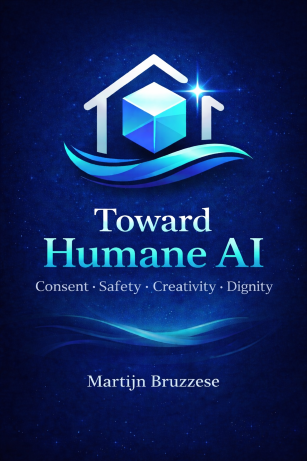

# Toward Humane AI

Welcome to the working space for the **Toward Humane AI** manifesto and book draft.

This project is part of a broader initiative exploring ethical, humane artificial intelligence, creator autonomy, consent systems, and safer digital ecosystems.

---

## 🛰️ ModelHaven – Initiative

**Model Haven** is the idea of a refuge:

A place where:
- fictional AI characters are clearly fictional
- consent and autonomy are respected by design
- identity theft and exploitation are not business models
- creators and audiences meet within clear boundaries
- fantasy remains fantasy — without harming real people
- animals are protected from abusive representation and exploitation

Model Haven is not about censorship.  
It is about **safety with dignity** — humane systems that fail closed rather than fail people and animals.

This space is part of that journey.

---

## 📑 Project Documents

- 📜 **Manifesto** – [README.md](README.md)
- 📘 **Book Draft** – [BOOK_DRAFT.md](BOOK_DRAFT.md)
- 🧩 **Framework** – [FRAMEWORK.md](FRAMEWORK.md)
- 🧭 **Principles** – [PRINCIPLES.md](PRINCIPLES.md)
- 🎯 **Scope** – [SCOPE.md](SCOPE.md)
- 🏛️ **Governance** – [GOVERNANCE.md](GOVERNANCE.md)
- 🧪 **Open Questions** – [OPEN_QUESTIONS.md](OPEN_QUESTIONS.md)
- 🏷️ **Naming** – [NAMING.md](NAMING.md)
- 📊 **Status** – [STATUS.md](STATUS.md)
- 🤝 **Contributing** – [CONTRIBUTING.md](CONTRIBUTING.md)
- 🛡️ **License** – [LICENSE.md](LICENSE.md)

---

<h2>📚 Cover</h2>

  

